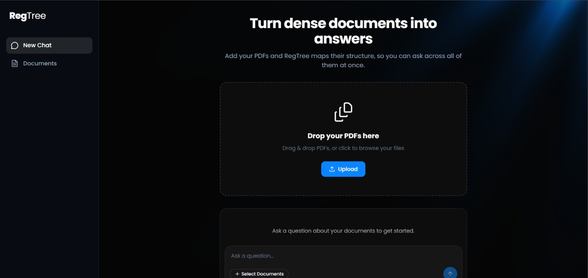
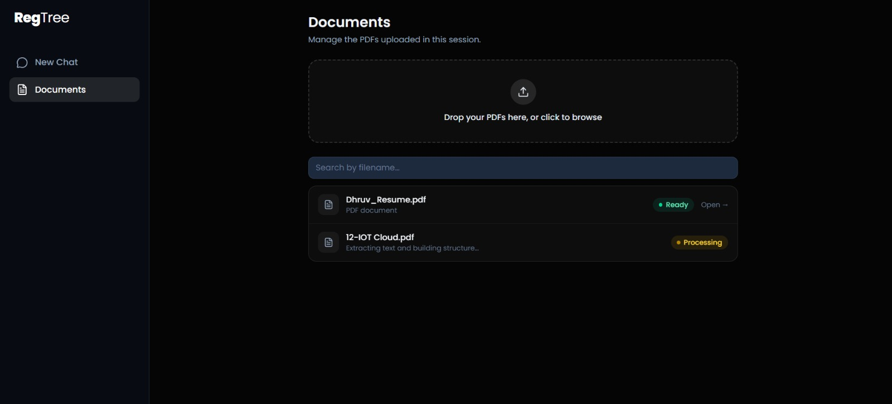
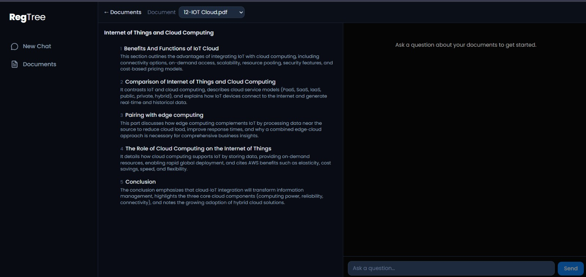
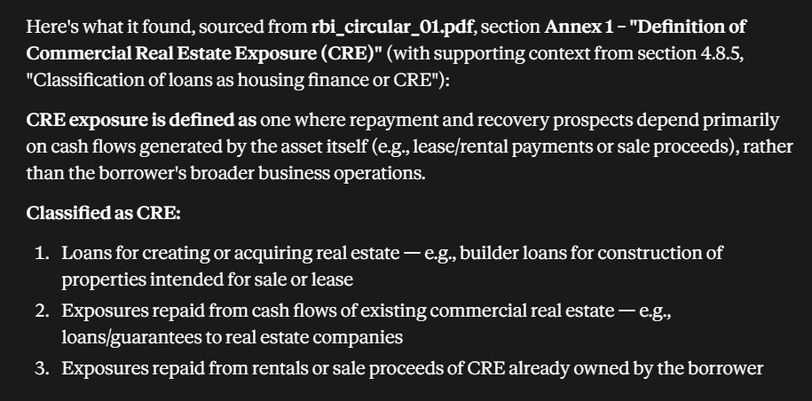
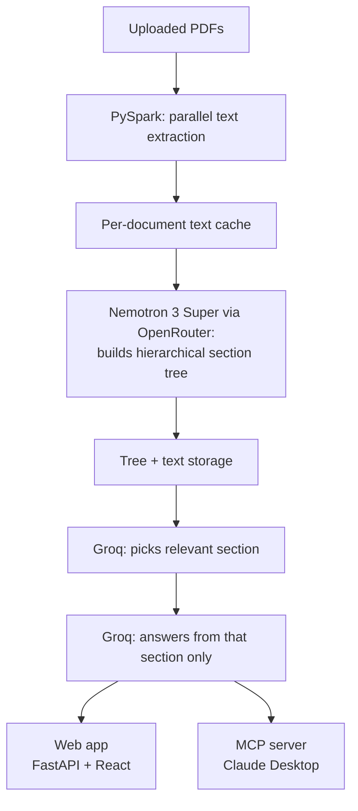

# RegTree

**A vectorless RAG system for regulatory documents — built with PySpark, reasoning-based retrieval, and an MCP server for use directly from Claude Desktop.**

RegTree lets you upload regulatory/financial PDFs, builds a hierarchical, human-readable structure of each document (no embeddings, no vector database), and answers questions by reasoning over that structure — with every answer traceable back to the exact section it came from. The same engine is exposed two ways: a web app, and an MCP server usable straight from Claude Desktop.

## Key features

- **Ask across everything in a session, not just one document.** Once you've uploaded multiple PDFs, a single question searches across all of them — RegTree isn't limited to whichever document you happen to have open. Ask something like "what do these documents say about X" and it reasons across the full set.
- **Every answer cites its source.** Each response names the exact document and section it came from, so answers are traceable and verifiable rather than a black box.
- **Same pipeline, two ways in.** The web app and the MCP server (Claude Desktop) both call the identical underlying retrieval logic — no duplicated code, no divergent behavior between the two.

---

## Screenshots

### Home


### Documents


### Document Workspace


### MCP — Claude Desktop



---

## Why "vectorless" RAG

Most RAG systems chunk documents and search by embedding similarity — fast, but the retrieval has no real understanding of the document's structure, and answers aren't easily traceable back to a specific section.

RegTree instead builds an actual hierarchical outline of each document (titles, section summaries, page ranges) and answers questions in two explicit steps:
1. An LLM reads the outline and picks which section is actually relevant to the question.
2. A second LLM call reads only that section's real text and answers.

This makes every answer explainable — you always know exactly which section it came from — instead of a black-box similarity match.

## Architecture



**Where PySpark actually earns its place:** it parallelizes text extraction across every uploaded document at once — real CPU-bound work. It intentionally does *not* touch the LLM calls, since those are rate-limited on their free tiers and parallelizing them would burn through quota faster, not help.

## Tech stack

| Layer | Tools |
|---|---|
| Distributed ingestion | PySpark (local mode), pdfplumber |
| Tree building | Nemotron 3 Super via OpenRouter (free tier) |
| Retrieval / Q&A | Groq — Llama 3.3 70B Versatile (free tier) |
| Backend API | FastAPI, session-cookie scoping (no accounts/login) |
| Frontend | React, TypeScript, Tailwind CSS, React Bits, shadcn (Base UI) |
| MCP layer | FastMCP — exposes the same pipeline as tools for Claude Desktop |
| Storage | Local filesystem, JSON-based (see [Roadmap](#roadmap)) |

## Key design decisions

- **Session-based, no accounts.** Each browser session gets an isolated set of documents via a random session cookie — no login, keeping the project's effort on RAG/PySpark/MCP rather than auth plumbing.
- **Two different models for two different jobs.** Nemotron (bigger, slower) builds each document's tree once; Groq (fast) answers every query — matching model size to how often each call actually happens.
- **MCP session is separate from web sessions.** Claude Desktop connects through its own fixed local session, independent from any browser session — different client types, intentionally isolated.

## Setup

### Prerequisites
- Python 3.12
- JDK 17 (Temurin recommended)
- Node.js 18+
- Free API keys: [Groq](https://console.groq.com), [OpenRouter](https://openrouter.ai)

### Backend
```powershell
cd backend
python -m venv venv
.\venv\Scripts\activate
pip install -r requirements.txt
```
Create `backend/.env`:
```
GROQ_API_KEY=your_key_here
OPENROUTER_API_KEY=your_key_here
```
Run:
```powershell
uvicorn main:app --reload
```

### Frontend
```powershell
cd frontend
npm install
npm run dev
```

### MCP server (optional — Claude Desktop integration)
```powershell
python -m pip install fastmcp==3.3.1
```
Add to Claude Desktop's `claude_desktop_config.json`:
```json
{
  "mcpServers": {
    "regtree": {
      "command": "C:\\path\\to\\backend\\venv\\Scripts\\python.exe",
      "args": ["C:\\path\\to\\backend\\mcp_server.py"]
    }
  }
}
```
Fully restart Claude Desktop after saving. Look for the hammer/tools icon in the chat input to confirm it's connected.

## Troubleshooting (Windows)

- **`Java not found` / `JAVA_HOME` errors:** install JDK 17 (`winget install EclipseAdoptium.Temurin.17.JDK`), set `JAVA_HOME` as a *system* environment variable pointing to the exact installed folder, add `%JAVA_HOME%\bin` to PATH. Use the System Properties GUI, not `setx`, to avoid truncating a long PATH.
- **`Did not find winutils.exe`:** PySpark 4.x bundles Hadoop 3.4, which currently has no available `winutils` build. This project pins `pyspark==3.5.8` (Hadoop 3.3.6) specifically for this reason. Get `winutils.exe`/`hadoop.dll` for 3.3.6 from the `cdarlint/winutils` GitHub repo, place in `C:\hadoop\bin`, set `HADOOP_HOME=C:\hadoop`.
- **`Python worker exited unexpectedly` / `EOFException`:** a real CPython 3.12 + Windows bug — PySpark's worker can lose its final buffered write during interpreter shutdown before the JVM reads it. Fixed here via `fix_pyspark_worker.py`, which patches `pyspark/worker.py` to flush explicitly on exit. **Re-run this script after any `pyspark` reinstall/upgrade**, since it overwrites the patch.
- **`ModuleNotFoundError: No module named 'ingest'` (Spark workers):** happens if the app is launched from a different working directory than `backend/`. Both `main.py` and `mcp_server.py` set `PYTHONPATH` explicitly at startup to guard against this — if you still hit it, confirm you're running the latest code.
- **`pip install` blocked by "Application Control policy":** a Windows security feature blocking `pip.exe` directly. Use `python -m pip install ...` instead.

## Roadmap

- **Migrate from local file storage to Supabase** (Postgres for metadata/tree JSON, Storage for PDFs) — deprioritized in favor of finishing the MCP layer first, but the natural next step for production-readiness.
- Optional: scrape RBI's Master Circulars page automatically instead of manual download (blocked today by CAPTCHA protection on direct PDF links).

## Acknowledgments

Retrieval approach inspired by the [PageIndex](https://github.com/VectifyAI/PageIndex) methodology — this project is an independent implementation of the same core idea (reasoning-based, vectorless retrieval over a document's hierarchical structure), not built on their codebase.
